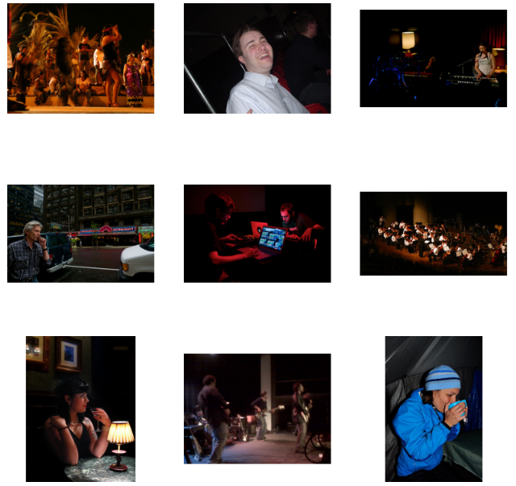

## Simple-CLIP-Implementation
----------------------------------
#### A simplified Implementation of the CLIP (Contrastive Language Image PreTraining) model by OpenAI. The model works by learning similarities between images and text. Then given an input the model is able to retrieve images most similar to the user's prompt.
-------------------------------------------------------------------------------------------------------------
#### Training is compute intensive and the model seems highly unstable so for now I'm just tuning hyperparameters.
-------------------------------------------------------------------------------------------------------------

Trial Image 1

 The input prompt was "turtles in the ocean" and yet this was the result.
 The training task was cut short and only went for about 8 epochs, the training loss however stopped decreasing after the 4th epoch and stayed the same; validation loss increased.

-------------------------------------------------------------------------------------------------------------
Note: This is an ongoing project, files will be updated with time.
